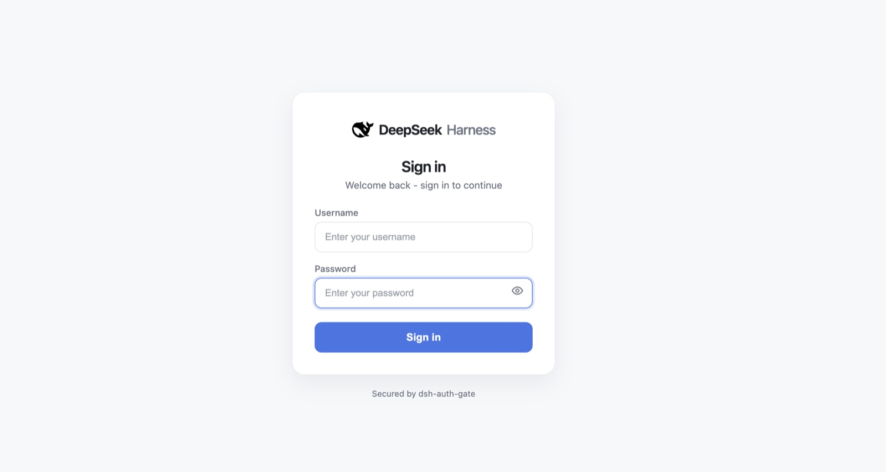

# DSH Server Kit

> A secure, Docker-first server distribution for DeepSeek Harness with web setup, password authentication, persistent storage, health checks, and repeatable upgrades.



把上游 [DeepSeek Harness](https://github.com/deepseek-ai/deepseek-harness) 封装为可部署、可升级的单管理员服务器发行版。

它不是新的 DSH UI 或 Gateway。DSH 提供 UI 与 Agent runtime；`dsh-auth-gate` 负责登录、会话以及 HTTP/WebSocket 守卫；Caddy 只提供安全反代；本仓库只负责不可变依赖、首启、健康状态、升级检查与部署契约。

## 当前发行组合

| 层 | 固定版本 |
| --- | --- |
| DSH | `@deepseek-ai/dsh@0.1.2-rc.1` |
| 认证 | `dsh-auth-gate@0.12.0`，密码模式、Secure Cookie、可选 TOTP |
| 可选工作台 | `dsh-better-sidebar@0.18.0` |
| 可选交易工作台 | `@dshtrading/{base,crypto,us,cn,hk}@0.1.1`（非商业许可） |
| Node | `24.14.0` |
| Caddy | `2.10.2` |

全部 npm 依赖通过提交的 `pnpm-lock.yaml` 锁定，并由 `pnpm@10.33.0` 构建；基础镜像以 digest 锁定。运行时绝不执行 `npm install`、`pnpm add` 或下载社区插件。

## 信任边界

```text
HTTPS / reverse proxy
        │ :8080
        ▼
      Caddy ── /healthz, /readyz, /versionz → status :9000
        │
        └── 保留公开 Host、移除外部转发标记 → DSH :3080 (127.0.0.1)
                                                       │
                                                       └── Auth Gate: page + API + WS
```

首次 Web 初始化会保存一个准确的公开 authority，例如 `dsh.example.com` 或 `dsh.example.com:8443`。启动器随后把它传给 DSH 的 `--trusted-host`，而 Caddy 保留浏览器的 `Host` 供 DSH 自己的 browser-trust fence 验证。不要使用 `https://`、路径、通配符或多个域名。

Caddy 也会在入口以 `421` 拒绝任何不等于该 authority 的 `Host`。这个 authority 在首次 Web 初始化时持久化，之后由启动器自动提供给 DSH 与 Caddy，无需持续配置环境变量。

端口 `3080` 与 `9000` 从不发布。Caddy 删除客户端伪造的 `Forwarded`、`X-Forwarded-*` 和 `X-Real-IP`。`dsh-auth-proxy --mark-proxy` 使用的 `X-Dsh-Proxy` 会被保留为只会收窄宿主能力的标记，伪造该标记也不能获得任何权限。登录限流应在外层反向代理或边缘网络配置；Auth Gate 在容器内看到的是 Caddy，而非真实客户端 IP。

## 使用 Dockerfile 部署

本项目的推荐方式是直接构建仓库根目录的 `Dockerfile`。运行时不需要管理员、密码或域名环境变量；首次浏览器初始化会把非敏感域名配置和密码哈希状态写入持久化数据目录。

### 1. 拉取发布镜像或从源码构建

正式版本同时发布到 GitHub Container Registry。生产部署建议使用精确版本 tag：

```sh
docker pull ghcr.io/jamailar/dsh-server-kit:0.1.0
```

`0.1` 跟随该 minor 版本的后续补丁；`0.1.0` 始终指向本次发布。若要从源码自行构建：

```sh
git clone https://github.com/Jamailar/dsh-server-kit.git
cd dsh-server-kit
docker build --tag dsh-server-kit:latest .
```

然后创建唯一持久卷：

```sh
docker volume create dsh-data
```

`dsh-data` 是唯一必须保留的 Docker Volume。不要在升级或清理容器时执行 `docker volume rm dsh-data`。

若你更希望直接管理服务器上的目录，可创建例如 `/srv/dsh-server-kit/data`，并在下面的启动命令中将 `--volume dsh-data:/data` 替换为 `--volume /srv/dsh-server-kit/data:/data`。两种方式二选一，容器内挂载路径始终是 `/data`。

### 2. 启动容器

下面的命令把服务仅绑定到本机回环地址；由同一台服务器上的 HTTPS 反向代理转发至 `127.0.0.1:8080`。

```sh
docker run --detach \
  --name dsh-server-kit \
  --restart unless-stopped \
  --publish 127.0.0.1:8080:8080 \
  --volume dsh-data:/data \
  ghcr.io/jamailar/dsh-server-kit:0.1.0
```

若使用上一步本地构建的镜像，将最后一行改为 `dsh-server-kit:latest`。

反向代理必须终止 HTTPS、保留浏览器请求的原始 `Host`，并将请求转发给 `http://127.0.0.1:8080`。不要发布 DSH 内部的 `3080` 或状态端口 `9000`。直接 HTTP 只能用于健康检查，不能登录：认证 Cookie 强制 `Secure`。

### 3. 完成首次初始化

访问 `https://你的域名/setup`，填入准确的公开域名、管理员用户名和密码。公开域名只能是 `dsh.example.com` 这类 authority，不能带 `https://` 或路径。

管理员用户名须以字母或数字开头，只能包含字母、数字、`.`、`_`、`-`，最长 64 个字符；不支持邮箱。初始化成功后，容器自动启动 DSH；等待就绪检查返回 `200` 后登录：

```sh
curl --fail \
  -H 'Host: dsh.example.com' \
  http://127.0.0.1:8080/readyz
```

默认初始化模式不需要环境变量，也不显示一次性码。它仅适用于你能控制第一个 `/setup` 访问者的情形。若域名已经公开，在启动命令中额外加上 `--env DSH_SETUP_PROTECTION=code`；然后从 `docker logs dsh-server-kit` 取得一次性码并填入页面。初始化完成后该码会删除。

### 首次初始化排查

初始化失败时先查看容器日志：

```sh
docker logs --tail 100 dsh-server-kit
```

日志使用 JSON 事件，不记录管理员密码或一次性初始化码。重点关注 `setup_auth_user_failed`（Auth Gate 的具体失败原因）、`setup_existing_admin_password_mismatch`（已有同名管理员但密码不同）、`setup_runtime_config_write_failed`（`/data` 不可写）和 `setup_request_failed`（请求校验或最终失败）。若首次请求在管理员创建后中断，使用同一用户名与同一密码再次提交即可安全完成域名配置；密码不匹配时不会覆盖已有账户。

### 4. 持久化数据说明

唯一的 Volume 挂载到容器 `/data`，内部目录如下：

| 路径 | 持久化内容 |
| --- | --- |
| `/data/dsh` | DSH Profile、管理员密码哈希、会话、模型与插件配置。 |
| `/data/dsh-server` | 公开域名运行配置、版本与升级状态。 |
| `/data/workspace` | DSH 读写的项目与工作文件。 |

备份、迁移和回滚时以整个 `dsh-data` 为单位处理，并使用加密存储；其中可能包含模型凭据与项目文件。若从旧的三 Volume 版本迁移，先做快照，再将旧 `dsh-home`、`dsh-server`、`dsh-workspace` 的内容分别复制到新 Volume 的 `dsh`、`dsh-server`、`workspace` 子目录。不要给已有实例换上空的 `/data` Volume。

### 5. 升级镜像

先备份 `dsh-data`，构建新镜像，再仅替换容器并继续挂载同一个 Volume：

```sh
docker build --tag dsh-server-kit:next .
docker stop dsh-server-kit
docker rm dsh-server-kit
# 使用上面的 docker run 命令重新启动；将镜像名改为 dsh-server-kit:next，Volume 仍为 dsh-data:/data。
```

启动器会更新受管理的 Profile 声明并检查版本组合；`/readyz` 未通过时，应切回上一个镜像标签，必要时恢复升级前的完整 Volume 快照。

升级镜像时，启动器只会在镜像的受管理 Profile 声明发生变化时，从新镜像复制预构建的 `node_modules`、锁文件和 Profile 元数据到 `/data/dsh/profiles/web`；它不会在运行时执行包安装或下载，也不会改写 `/data/dsh` 里的管理员、会话、模型配置或 `/data/workspace`。这一步会自动修复早期镜像遗漏的 Auth Gate 依赖。

浏览器不能安全、持久地改写部署环境变量；因此向导保存的是 `/data/dsh-server/runtime-config.json`。之后的启动由 entrypoint 读取该文件并把可信域名传给 DSH/Caddy，达到“不再需要部署变量”的效果。已有旧部署若尚无此配置，可以保留一次 `DSH_TRUSTED_HOST` 启动后迁移；其值必须与持久化域名完全一致。

## 预置与边界

`DSH_UI_PRESET` 是部署级启动配置，而不是网页内的即时开关。它决定 DSH 启动时装载的锁定依赖、Profile Bundle 和页面模块；一次容器启动只能选择一个预置。未设置时默认使用 `base`。

| 值 | 界面与定位 | 来源仓库 | 状态 |
| --- | --- | --- | --- |
| `base`（默认） | 官方 DSH Web UI + 密码登录 | [DeepSeek Harness](https://github.com/deepseek-ai/deepseek-harness)、[dsh-auth-gate](https://github.com/zephaniahwang94-cmyk/dsh-auth-gate) | 默认、最小预置 |
| `workbench` | `base` 加上文件、编辑、终端、Git 和浏览器侧边栏工作台 | [DSH-better-sidebar](https://github.com/omdsh-dev/DSH-better-sidebar)；同时复用 `base` 的两个来源 | 已锁定构建；尚未完成完整浏览器功能验收，不标为生产支持 |
| `trading` | 加密货币、美股、A 股、港股交易工作台 | [dsh-trading](https://github.com/zhu1090093659/dsh-trading)；同时复用 `base` 的两个来源 | 已集成；受 PolyForm Noncommercial 1.0.0 非商业许可约束 |

`dsh-web-all` 不在镜像中安装。它的 SSH、远程配对、计划任务等能力需在克隆 Volume 上单独审计；本项目不自动安装或升级它。

### 切换 Preset

切换预置需要修改容器环境变量并**重建容器**；不能在已打开的网页内即时切换。原因是切换会更换 DSH 的启动依赖与 UI 模块，必须由一个完整的新进程加载。切换时使用同一个 `/data` Volume，管理员、模型配置、工作区和各预置的数据都会保留。

例如，切换到 Trading：

```sh
docker stop dsh-server-kit
docker rm dsh-server-kit
docker run --detach \
  --name dsh-server-kit \
  --restart unless-stopped \
  --publish 127.0.0.1:8080:8080 \
  --volume dsh-data:/data \
  --env DSH_UI_PRESET=trading \
  dsh-server-kit:latest
```

切回默认界面时，移除 `--env DSH_UI_PRESET=trading`，或显式改成 `--env DSH_UI_PRESET=base`，然后用同一个 `/data` Volume 重建容器。切换到 `workbench` 时将值改为 `workbench`。先备份 `/data`，不要让两个容器同时写同一个 Volume。

新预置也遵循此模型：先在镜像中以精确版本集成、锁定依赖并通过验证，才可以使用 `DSH_UI_PRESET=<名称>` 启动；任意输入一个社区包名不会让容器在运行时自动安装它。

### 启用 Trading

Trading 是整站预置，不是在普通聊天页面叠加一个开关；一次只运行一个预置，避免多个侧边栏争用同一界面。默认仍为 `base`。

先阅读 [第三方许可说明](THIRD_PARTY_NOTICES.md)：`dsh-trading` 使用 **PolyForm Noncommercial 1.0.0**，不是无限制商用的开源许可；商业用途需向上游取得适用授权。镜像包含这些包，即使未启用 Trading，也不要忽略其分发条款。

新部署在前面的 `docker run` 命令中加入 `--env DSH_UI_PRESET=trading` 即可。已有部署先备份整个 `dsh-data`，从当前源码构建新镜像，再替换容器：

```sh
docker build --tag dsh-server-kit:trading .
docker stop dsh-server-kit
docker rm dsh-server-kit
docker run --detach \
  --name dsh-server-kit \
  --restart unless-stopped \
  --publish 127.0.0.1:8080:8080 \
  --volume dsh-data:/data \
  --env DSH_UI_PRESET=trading \
  dsh-server-kit:trading
```

继续使用原来的域名、HTTPS 反代和 `/data` Volume。不要换成空卷，也不要同时让两个实例写同一个卷。已有管理员、模型配置与会话无需重新创建；等待 `/readyz` 返回 `200` 后刷新页面并登录。旧的已发布镜像未必包含此预置，以上命令使用当前源码构建。

Trading 复用上游的行情、自选、图表、指标、策略、知识与交易审批功能。本仓库不另写行情接口或下单引擎。使用顺序：

1. 在设置中配置模型提供方和模型凭据，再选择市场与行情来源。
2. 在交易工作台添加自选标的，查看行情；需要 Agent 时选择相应市场的交易预设并创建会话。
3. 默认使用上游模拟配置（`dryRun: true`、`liveTrading: false`），不要把安装成功理解为实盘已配置。实盘还需要券商/交易所账号、凭据及对应连接器配置；非模拟下单/撤单保留上游人工审批，不自动批准。

部分行情来源需要 API Key、数据订阅或地区网络可达性；IBKR、QMT 等连接器还可能依赖额外网关/本机服务，这些服务并未随容器安装。四个市场模块已打包不代表所有券商都无需配置即可使用。此集成不保证行情可用性或交易结果。

仍然只挂载 **`/data`**。Trading 按上游约定将自选、当前标的、指标、策略和知识写入 `/data/workspace/.dsh/`，托管的市场 Agent 预设写入 `/data/workspace/.dsh-trading-presets/`；这两个隐藏目录均在现有持久卷内。模型、交易来源设置与凭据继续由 DSH 管理。备份时不要排除隐藏目录。

要恢复普通界面，用同一镜像和同一 Volume 重建容器，将 `DSH_UI_PRESET` 改回 `base`（或 `workbench`）。Trading 数据保留，之后可再次切回。Profile 的包声明、锁文件、bundle 和认证补丁由发行版管理，不要在其内手工 `pnpm add` 或改受管理文件。

### 公开域名配置模型与提供方

上游 DSH 默认只允许 loopback 页面编辑“设置 → 模型/提供方/凭据”。本发行版在**镜像构建期**对锁定的 DSH `0.1.2-rc.1` 客户端应用一个最小补丁，因此管理员可直接在已配置的 HTTPS 域名完成模型与凭据配置，无需本机代理。

这个补丁只把 Settings 的持久化通道从浏览器本地内存切换为受 DSH 服务端管理的配置；不绕过 Auth Gate，所有设置和凭据 API 仍须有效管理员会话。它按包名、版本与唯一的上游代码边界校验；以后升级 DSH 时，若实现变化，镜像构建会失败而不是悄悄失去保护或产生部分功能。

`dsh-auth-proxy --mark-proxy` 仍可作为受控电脑上的可选入口；其标记只能让服务端额外拒绝宿主能力，不能授予任何权限。

这是单一可信管理员、共享工作区实例，不是多用户隔离或多租户产品。

## 升级与回滚

每次升级替换镜像，保留 `/data` 中的业务数据。启动器只更新受管理的 Profile 依赖与声明；随后 `scripts/preflight-upgrade.mjs` 检查依赖、bundle 顺序、锁文件和 Auth 配置 attestation，仍不匹配就 fail closed，不运行在线包安装。

升级动作：先对 `/data` Volume 建快照 → 记录当前 image digest → 部署新 digest → 等待 `/readyz` → 验证匿名请求得到 `401` 与登录流程。失败时切回上一个 digest；若上游运行期间更改了业务数据格式，应恢复升级前的完整快照。

## 验证

```sh
node scripts/build-seed-profile.mjs --verify-only
node --test tests/unit/*.test.mjs
node tests/integration/contract.mjs
```

GitHub Actions 在 Node 24 下执行上述检查，并构建真实容器，确认 `readyz`、匿名 `401` 与 Auth Gate 状态端点。Trading 集成检查还会用隔离的临时数据启动真实 DSH，验证登录、交易 API/SSE 鉴权、四市场注册、浏览器启动清单和重启后的自选数据；不连接券商或发送订单。完整架构、组件准入和发布准则见 [执行计划](docs/EXECUTION_PLAN.md)。
